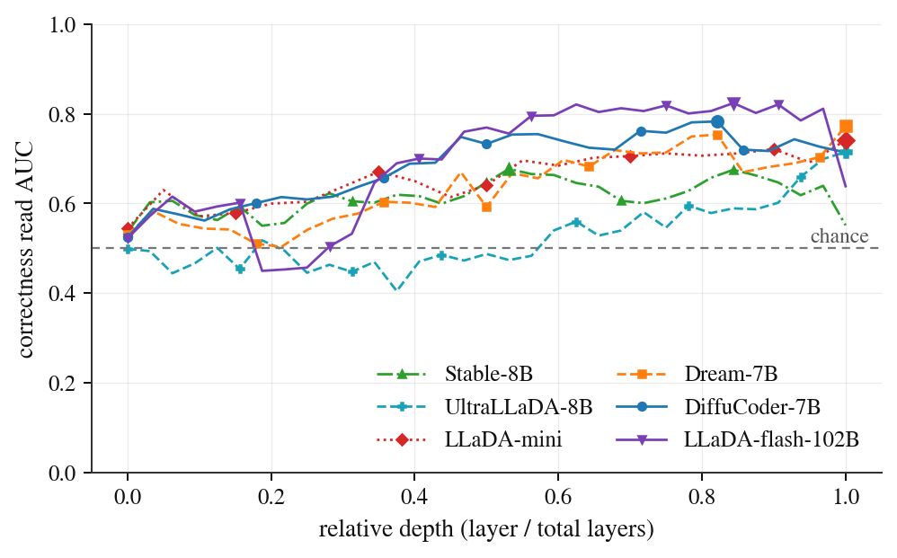

# A Heckler in the Hidden State

**Correctness Signals in Diffusion Language Models**

Research code and results for the paper by Angad Miglani, Samrath Singh Chadha, Kevin Li, and Manas Venkata Sai Ravulapalli, Efficient Computation Inc.

Can a code model's hidden states tell us whether its answer is correct, and can that information help it write better code? We study linear correctness probes across six diffusion models, compare them with model confidence, and test activation steering. The probes distinguish passing from failing programs, but the tested steering procedures do not produce a dependable improvement in generated code.

## Explore the results

| Start with | What it contains |
| --- | --- |
| [Data guide](docs/DATA_GUIDE.md) | The input files behind each graph and experimental comparison |
| [Result tables](data/tables/) | Probe, confidence, perturbation, final-layer, and steering summaries |
| [Per-task steering outcomes](data/steering/) | Passing and compiling outcomes for the eleven intervention conditions |
| [Experiment notes](docs/EXPERIMENTS.md) | Models, tasks, analysis procedures, and requirements for new runs |



Correctness-probe AUC across network depth. These curves are reconstructed from the supplied layerwise results; the [data guide](docs/DATA_GUIDE.md) distinguishes them from the original peak selections.

## Reproduce the figures

The included data are sufficient to redraw all seven graphs. No model download or inference is needed. With Python 3.12:

```bash
git clone https://github.com/efficientcomputation/heckler-in-the-hidden-state.git
cd heckler-in-the-hidden-state
python3 -m venv .venv
.venv/bin/python -m pip install -r requirements/figures.txt
.venv/bin/python scripts/manifest.py
.venv/bin/python scripts/plot_figures.py
```

The command writes graph PDFs to `build/figures/` and PNG previews to `build/checks/`. It checks every graph's numerical coordinates against the supplied reference values. See the [reproduction guide](docs/REPRODUCING.md) for output files and verification details.

## Run new experiments

The capture, probing, and steering scripts are in [code/campaign/](code/campaign/); perturbation scripts are in [code/perturbations/](code/perturbations/). They preserve the original experiment implementations.

New model runs require model weights, experiment inputs, and helper modules that are not included here; downstream analyses also need the original activation shards. The [experiment notes](docs/EXPERIMENTS.md) list the requirements for each script, original path assumptions, and statistical limitations. The figure-only environment does not provide a complete inference environment.

## Repository layout

```text
code/           Capture, analysis, steering, and perturbation scripts
data/           Compact result files and per-task outcomes
docs/           Data guide, methods, reproduction steps, and provenance
requirements/   Tested plotting dependencies and experiment dependency inventory
scripts/        Figure generation and file-integrity verification
```

## Citation

If you use these results or code, cite *A Heckler in the Hidden State: Correctness Signals in Diffusion Language Models* by Angad Miglani, Samrath Singh Chadha, Kevin Li, and Manas Venkata Sai Ravulapalli (2026). Citation metadata is in [CITATION.cff](CITATION.cff).

## Questions and corrections

Open a [GitHub issue](https://github.com/efficientcomputation/heckler-in-the-hidden-state/issues) with the relevant data file or command, repository commit, and expected versus observed output.

No repository-wide license is specified. Model and benchmark licenses apply separately. [Source provenance](docs/PROVENANCE.md) records where the supplied code and results came from.
